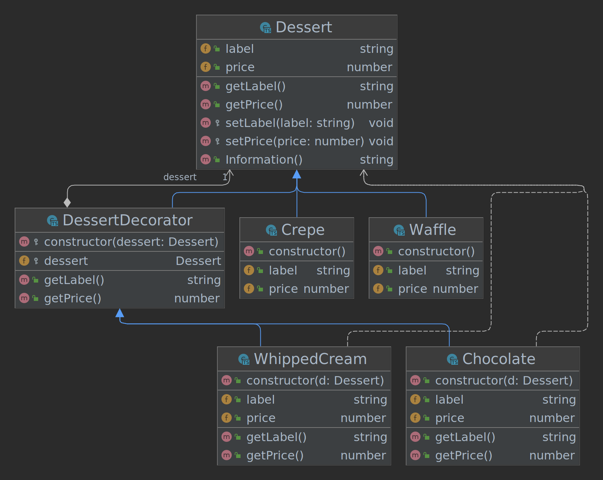

## Decorator



### Architecture
```
src
├── decorator
│   └── dessert.ts
├── desserts
│   ├── crepe.ts
│   ├── index.ts
│   └── waffle.ts
├── dessert.ts
├── index.ts
└── ingredients
    ├── chocolate.ts
    ├── index.ts
    └── whippedCream.ts

```

### Run project

Run this command if you change the HTML file or the first time you run the project
```
$ npm run copy-files
```

Build examples
```
$ npm run build
```

Start project
```
$ npm run dev
```