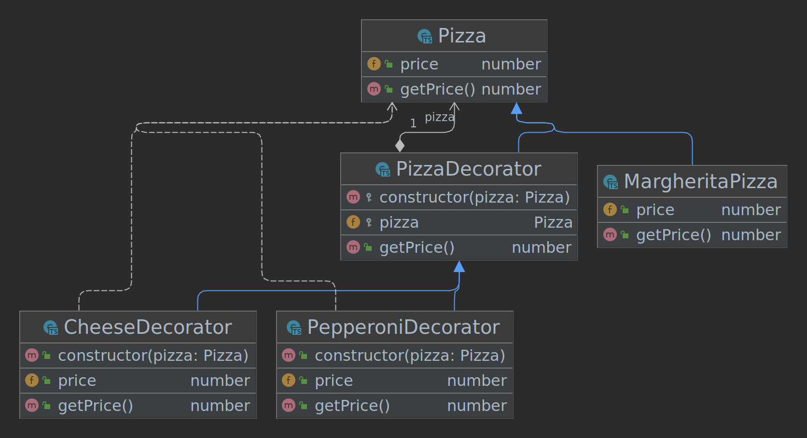

## Decorator

nous avons des exemples d'utilisation de ces classes pour créer une pizza Margherita de base, puis une pizza Margherita avec extra fromage, et enfin une pizza Margherita avec extra fromage et pepperoni, en utilisant les décorateurs CheeseDecorator et PepperoniDecorator respectivement.\
Les prix de chaque pizza sont affichés pour vérifier que les prix sont corrects.



### Architecture
```
src/
├── decorator
│   └── pizza.ts
├── index.ts
├── ingredients
│   ├── cheese.ts
│   ├── index.ts
│   └── pepperoni.ts
├── pizzas
│   └── margherita.ts
└── pizza.ts

```

### Run project

Run this command if you change the HTML file or the first time you run the project
```
$ npm run copy-files
```

Build examples
```
$ npm run build
```

Start project
```
$ npm run dev
```