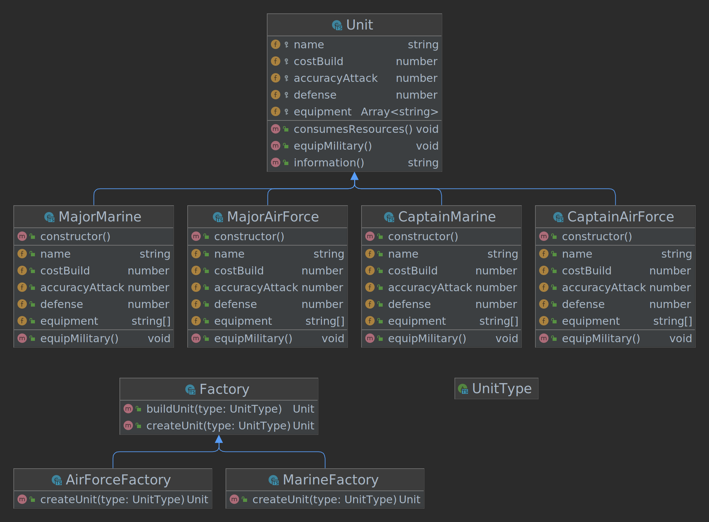

## Decorator



```
src
├── factories
│   ├── airForceFactory.ts
│   ├── factory.ts
│   ├── index.ts
│   └── marineFactory.ts
├── index.ts
└── units
    ├── airForce
    │   ├── captainAirForce.ts
    │   ├── index.ts
    │   └── majorAirForce.ts
    ├── index.ts
    ├── marine
    │   ├── captainMarine.ts
    │   ├── index.ts
    │   └── majorMarine.ts
    └── unit.ts

```

### Run project

Run this command if you change the HTML file or the first time you run the project
```
$ npm run copy-files
```

Build examples
```
$ npm run build
```

Start project
```
$ npm run dev
```