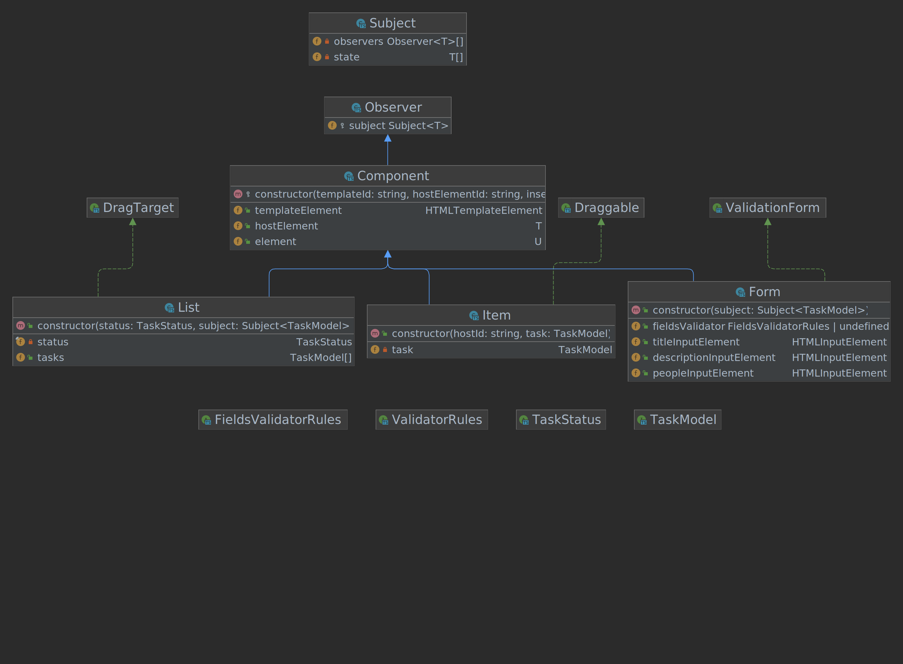

## Project Drag and Drop Tasks



### Architecture
```
src
├── decorators
│   ├── addValidationRules.ts
│   ├── autoBind.ts
│   └── index.ts
├── factory
│   ├── component.ts
│   ├── form.ts
│   ├── index.ts
│   ├── item.ts
│   └── list.ts
├── index.html
├── models
│   └── index.ts
├── observers
│   ├── index.ts
│   ├── observer.ts
│   └── subject.ts
├── script.css
├── script.ts
└── utils
    ├── constants.ts
    ├── dragDrop.ts
    ├── index.ts
    └── validation.ts

```

### Run project

Run this command if you change the HTML file or the first time you run the project
```
$ npm run copy-files
```

Build examples
```
$ npm run build
```

Start project
```
$ npm run dev
```